# Over View

- This project involves an analysis of store sales data to uncover insights and patterns that can help in understanding the factors that influence sales. The dataset contains various attributes of stores such as their area, the number of items available, daily customer count, and sales figures.

# Questions Asked
* How does the store area affect store sales?

  • Plot a scatter plot of Store_Area vs. Store_Sales to investigate if there’s a correlation between the area of a store and its sales figures.
* What is the distribution of store sales across all stores?

  • Create a histogram of Store_Sales to understand the distribution and identify any skewness or outliers in the sales data.
* Is there a relationship between the number of items available and daily customer count?

  • Plot a scatter plot of Items_Available vs. Daily_Customer_Count to see if stores with more items attract more customers on a daily basis.
* How do daily customer counts correlate with store sales?

  • Create a scatter plot of Daily_Customer_Count vs. Store_Sales to determine if stores with higher customer counts tend to have higher sales.

# Tools Used

- Python: Primary programming language used for data analysis.
- Pandas: For data manipulation and analysis.
- Matplotlib: For creating static, animated, and interactive visualizations.
- Seaborn: For statistical data visualization, built on top of Matplotlib.
- Jupyter Notebook: For interactive development and data exploration.
- VS Code (Visual Studio Code): As the code editor for writing and debugging code.
- Git: For version control and managing code changes.
- GitHub: For hosting and sharing the project repository and collaborating.

# Analysis

### Visualize

```py
import pandas as pd
import matplotlib.pyplot as plt
import seaborn as sns
import warnings
warnings.filterwarnings('ignore')
import plotly.express as px
pd.set_option('display.max_columns',None)
df = pd.read_csv('Stores.csv', encoding="UTF8")
# Checking for the clean dataset
has_null = df.isnull().values.any()
print(has_null)
#Checking for the null values
null_summary  = df.isnull().sum()
print(null_summary)
```

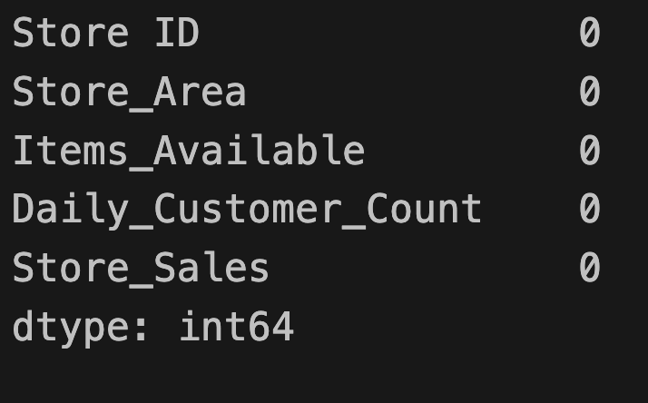

```py
df.describe()
```

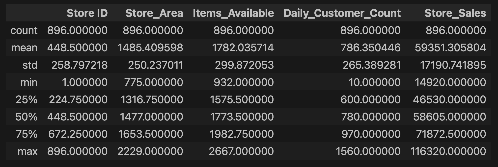

```py
df.info()
```

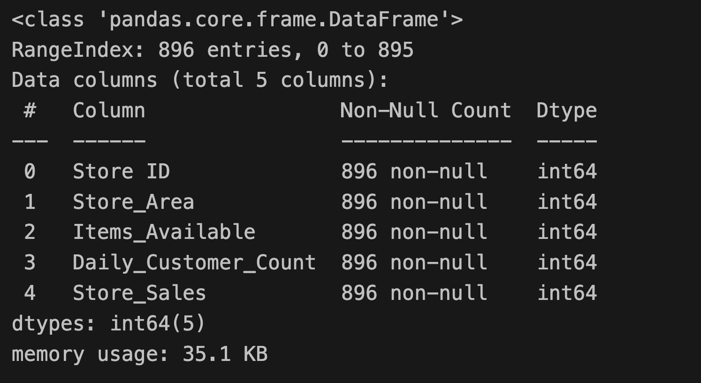

```py
df.corr()
```

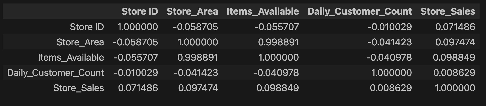

```py
plt.style.use('dark_background')
plt.figure(figsize=(20, 12))

ax1 = plt.subplot(2, 2, 1)
sns.histplot(df.Store_Area, color='red', ax=ax1, edgecolor='none', kde=True)
ax1.set_title('Store Area Distribution')
ax1.spines['top'].set_visible(False)
ax1.spines['right'].set_visible(False)

# Plot 2
ax2 = plt.subplot(2, 2, 2)
sns.histplot(df.Items_Available, color='blue', ax=ax2, edgecolor='none', kde=True)
ax2.set_title('Items Available Distribution')
ax2.spines['top'].set_visible(False)
ax2.spines['right'].set_visible(False)

# Plot 3
ax3 = plt.subplot(2, 2, 3)
sns.histplot(df.Daily_Customer_Count, color='gold', ax=ax3, edgecolor='none', kde=True)
ax3.set_title('Daily Customer Count Distribution')
ax3.spines['top'].set_visible(False)
ax3.spines['right'].set_visible(False)


# Plot 4
ax4 = plt.subplot(2, 2, 4)
sns.histplot(df.Store_Sales, color='green', ax=ax4, edgecolor='none', kde=True)
ax4.set_title('Store Sales Distribution', color='white')
ax4.spines['top'].set_visible(False)
ax4.spines['right'].set_visible(False)

plt.suptitle('Feature Distribution', fontsize=20)
plt.tight_layout(rect=[0, 0, 1, 0.96])
plt.show()
```

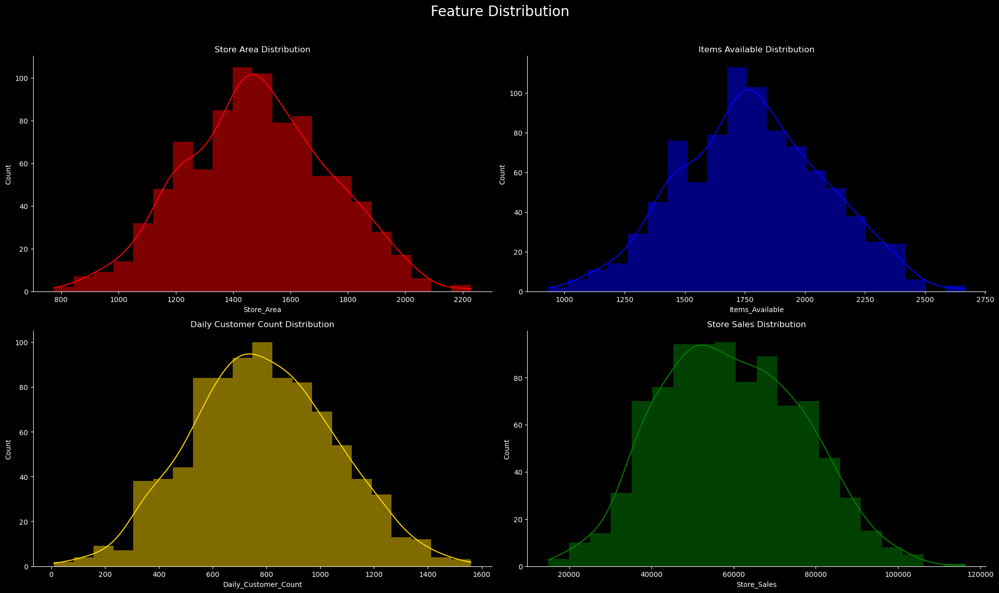

```
sns.jointplot(x='Daily_Customer_Count', y='Store_Sales', data=df, kind='reg', color='m')
plt.show()
```

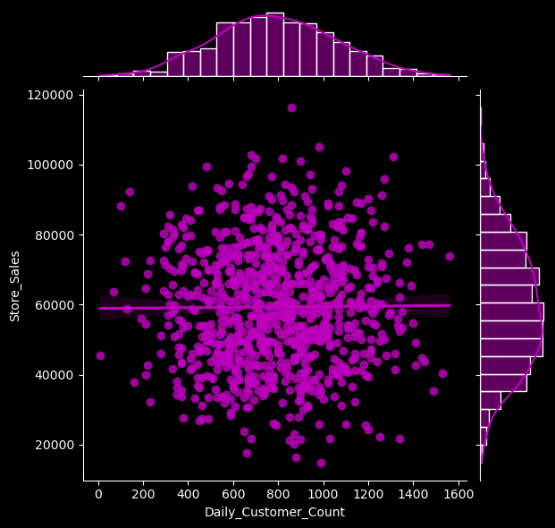

```py
sns.jointplot(x='Items_Available', y='Store_Sales', data=df, kind='reg', color='y')
plt.show()
```

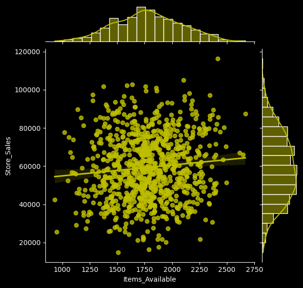

```py
sns.jointplot(x='Store_Area', y='Store_Sales', data=df, kind='reg', color='g')
plt.show()
```

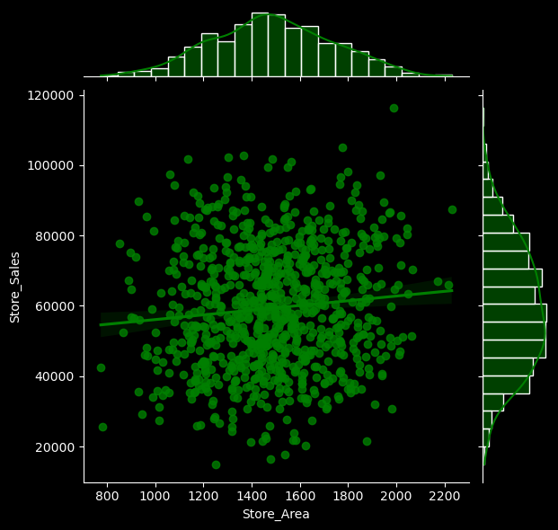

```py
sns.jointplot(x='Items_Available', y='Store_Area', data=df, kind='reg', color='orange')
plt.show()
```

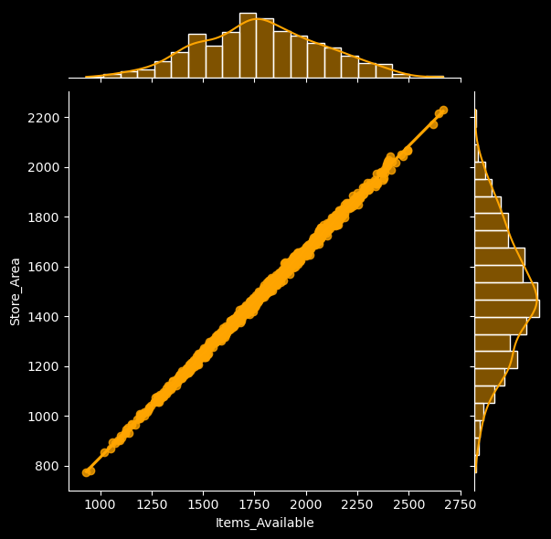

```py
sns.jointplot(x='Daily_Customer_Count', y='Store_Area', data=df, kind='reg', color='skyblue')
plt.show()
```

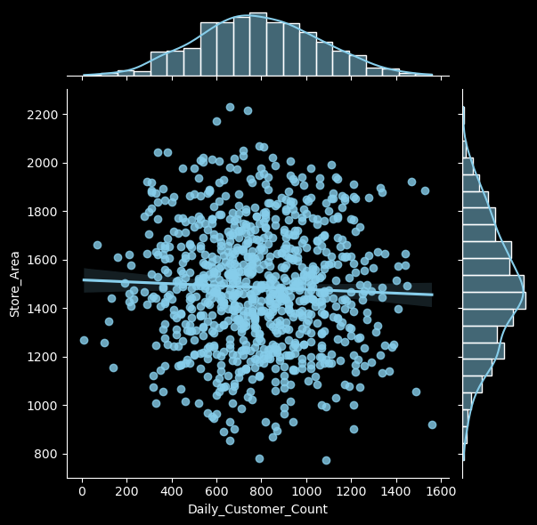

```py
sns.pairplot(df, corner=True)
plt.show()
```

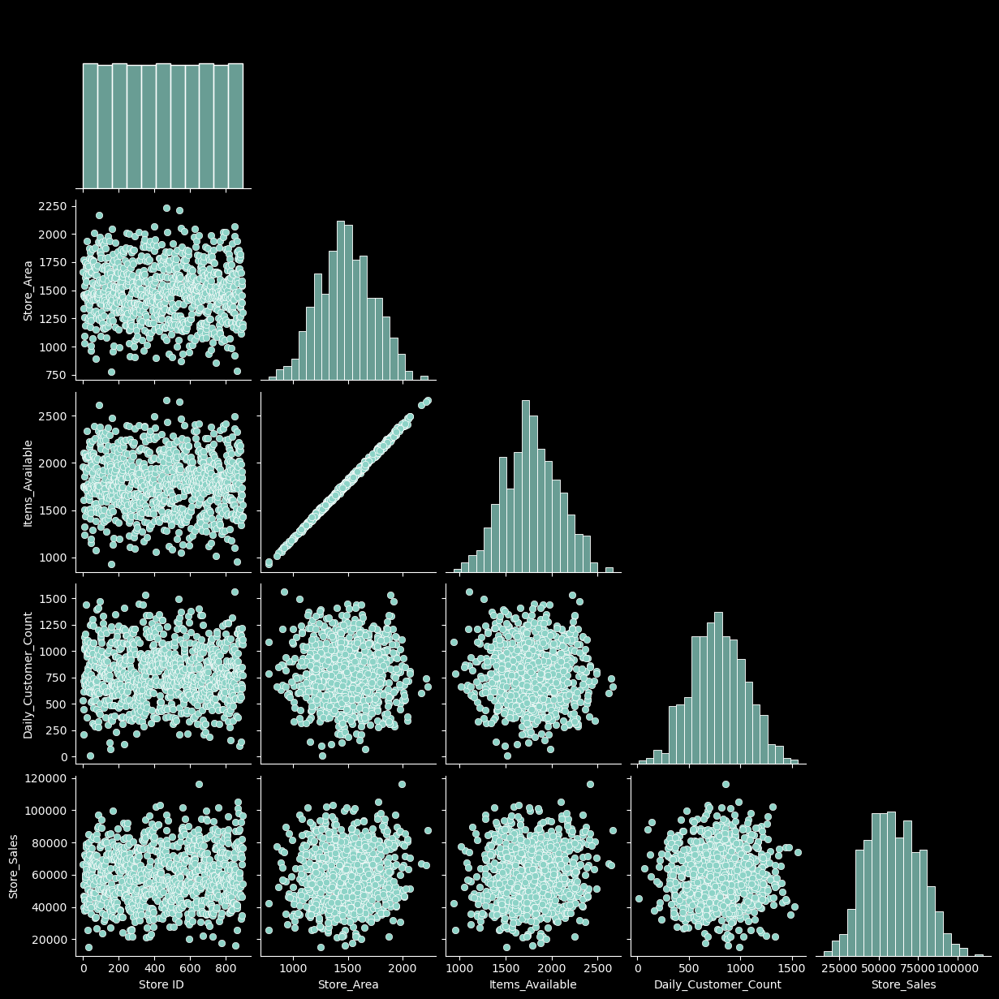

```py
px.scatter(df, df.Store_Area, df.Store_Sales, size='Store_Sales', color='Store_Sales', template='plotly_dark', title='Store_Sales VS Store_Area')
```

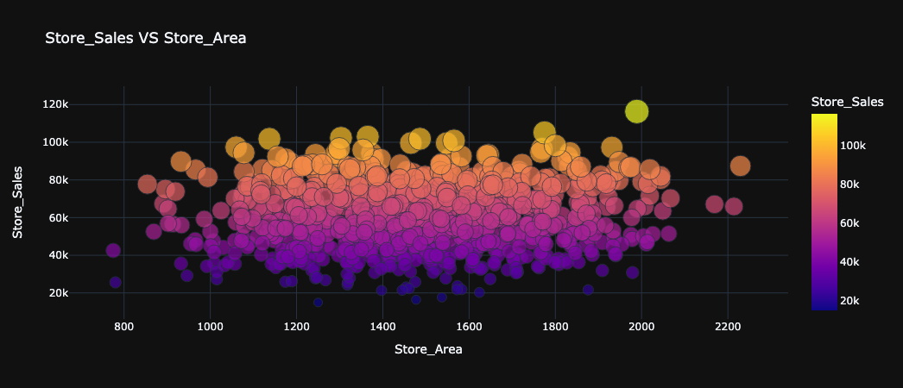

```py
px.scatter(df, df.Items_Available, df.Store_Sales, size='Items_Available', color='Store_Sales',
template='plotly_dark', title='Items_Available VS Store_Sales', color_continuous_scale=px.colors.sequential.Plotly3)
```

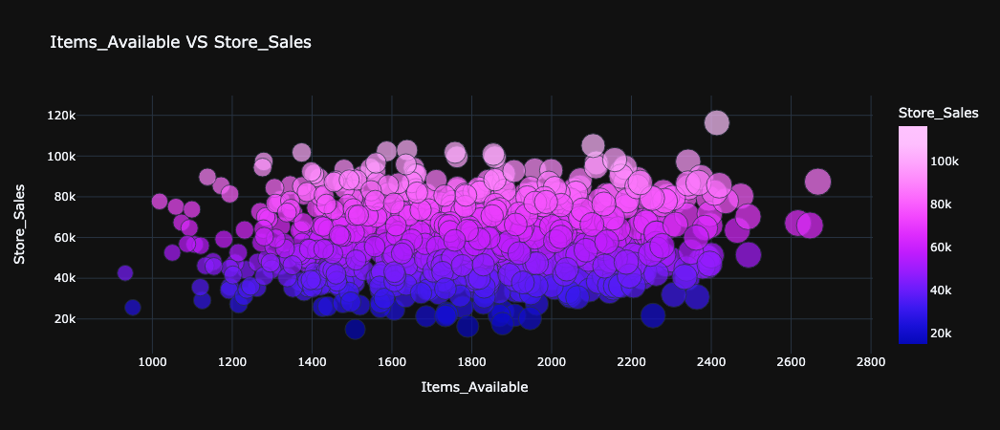

```py
px.scatter(df, df.Daily_Customer_Count, df.Store_Sales, size='Daily_Customer_Count', color='Store_Sales',
template='plotly_dark', title='Daily_Customer_Count VS Store_Sales', color_continuous_scale=px.colors.sequential.Plasma)
```


```py
px.scatter(df,x='Items_Available',y='Store_Area',template='plotly_dark',color_discrete_sequence=['lightgreen'],trendline='ols',title='Items_Available Vs Store_Area')
```

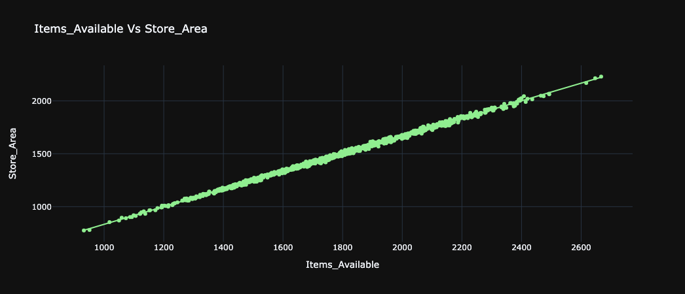

# Insights

- 1. Store Area vs. Store Sales:
     • The scatter plot of Store_Area vs. Store_Sales reveals a positive correlation between the area of a store and its sales figures. Larger stores tend to have higher sales, likely due to their capacity to accommodate more products and customers. This suggests that expanding the store area could be a viable strategy for increasing sales, as larger spaces may provide a better shopping experience and offer a wider variety of products.
  2. Distribution of Store Sales:
     • The histogram of Store_Sales shows the distribution of sales across all stores. The distribution might be skewed to the right, indicating that while most stores have moderate sales, a few stores achieve exceptionally high sales. This insight could lead to a deeper investigation into what makes these high-performing stores successful, such as location, management practices, or marketing strategies, which can then be replicated in other stores to boost their sales.
  3. Items Available vs. Daily Customer Count:
     • The scatter plot of Items_Available vs. Daily_Customer_Count shows that stores with a higher number of available items generally attract more customers. This positive relationship suggests that increasing the variety of items in stock can draw more customers to the store, as shoppers are likely to visit stores where they have a higher chance of finding what they need. Therefore, inventory management and expanding the range of products can be crucial factors in driving customer footfall.
  4. Daily Customer Count vs. Store Sales:
     • The scatter plot of Daily_Customer_Count vs. Store_Sales indicates a strong positive correlation between the number of daily customers and store sales. Stores that attract more customers on a daily basis tend to generate higher sales, underscoring the importance of customer engagement and retention strategies. This insight highlights the need for effective marketing campaigns, customer loyalty programs, and excellent customer service to increase the daily customer count and, consequently, the store sales.

# Conclusion

- The analysis of store sales data reveals that store size, product variety, and daily customer traffic are key drivers of sales performance. Larger stores with a greater number of items available tend to attract more customers, leading to higher sales figures. The positive correlations identified through this analysis suggest that expanding store areas, diversifying inventory, and implementing strategies to boost customer visits can significantly enhance store profitability. These insights provide actionable recommendations for optimizing store operations and achieving sustained business growth.
