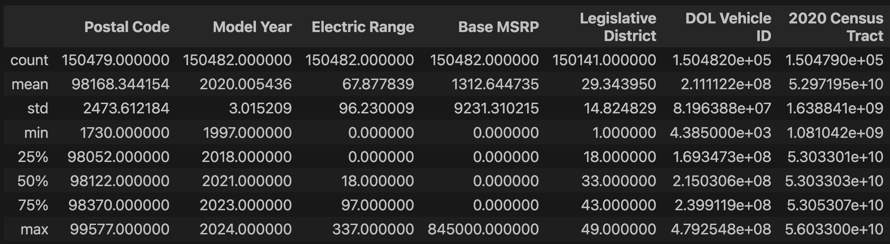
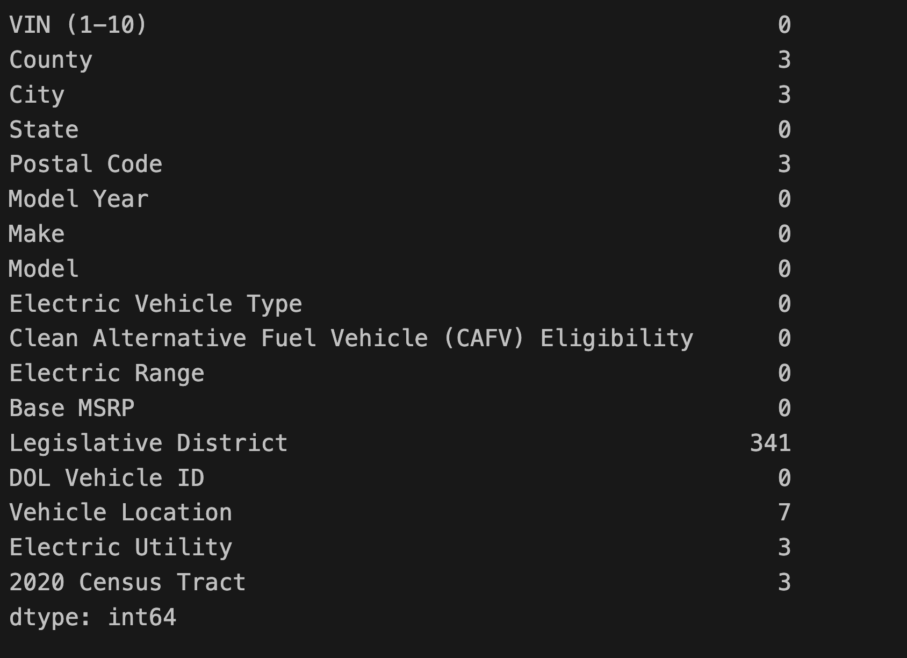
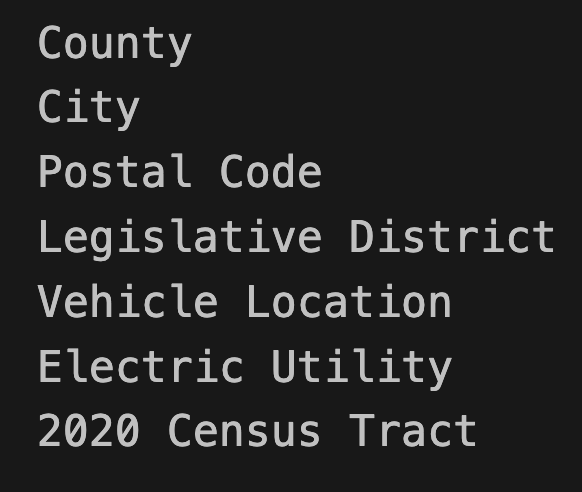
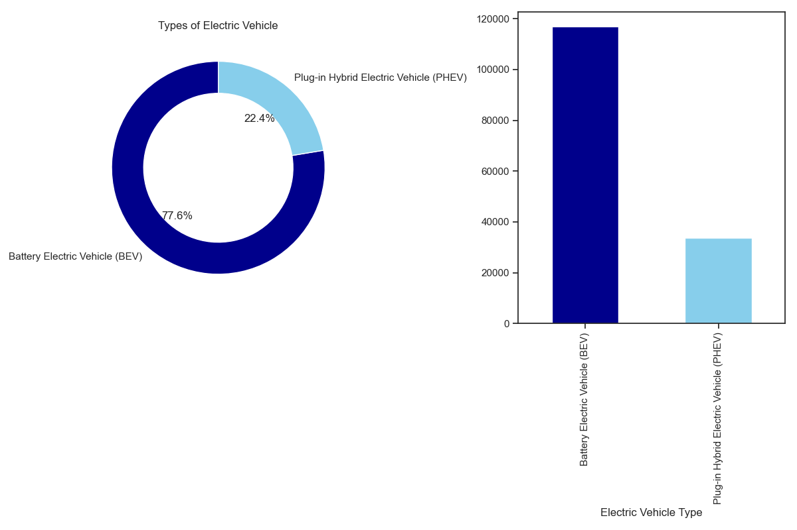
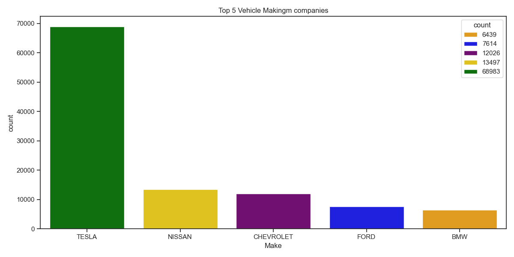
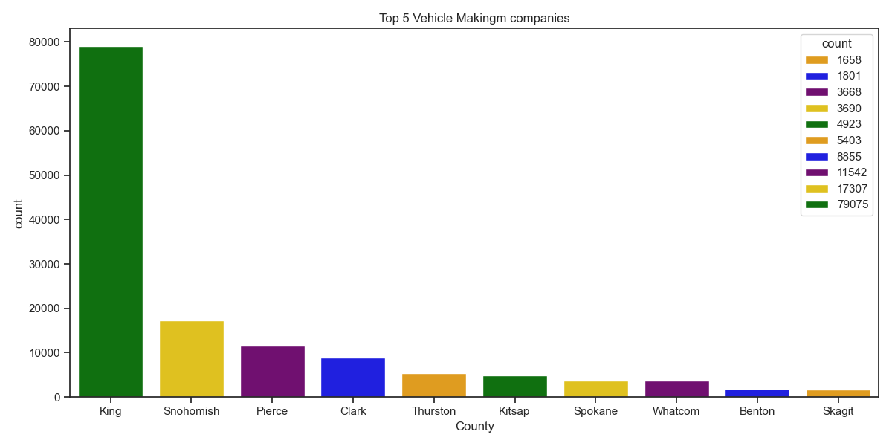
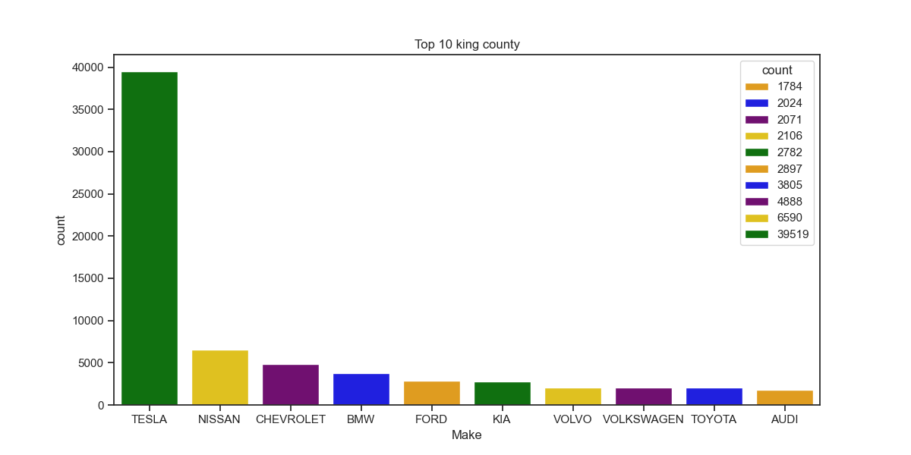
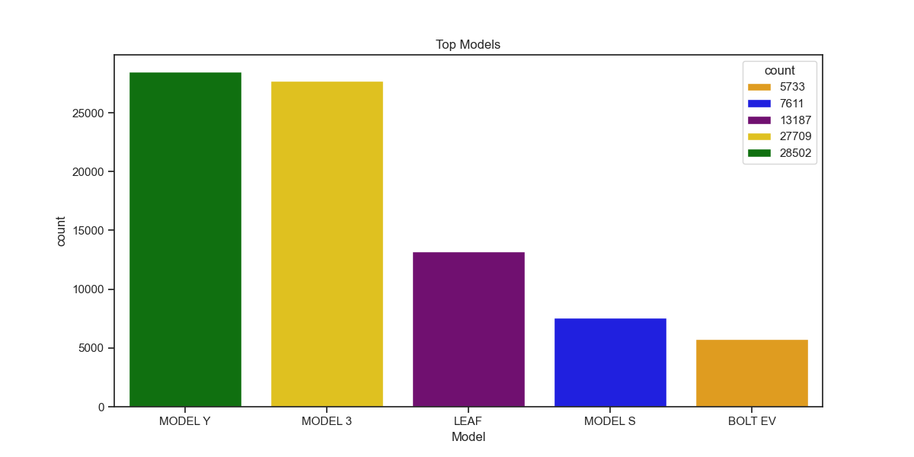
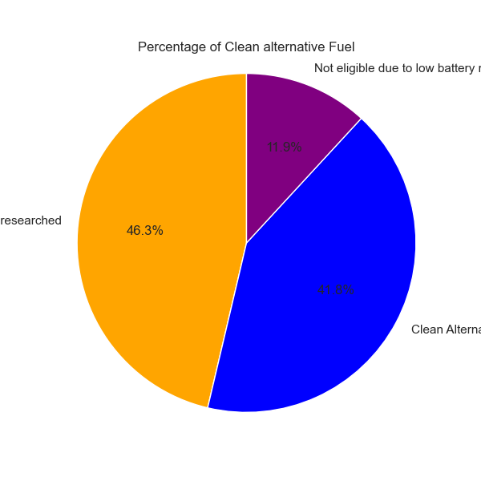
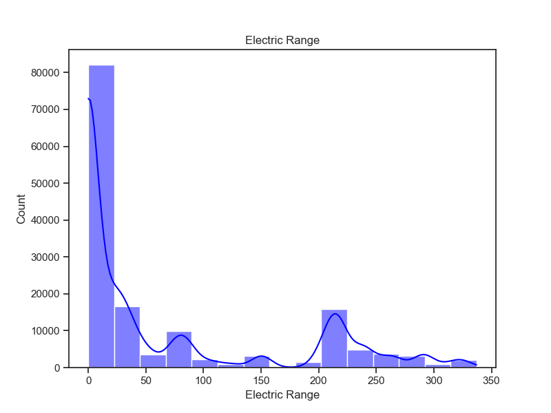

# Over View

- The objective of this project is to analyze and understand the electric vehicle (EV) population using data from the Electric_Vehicle_Population_Data.csv file. The analysis aims to uncover insights into the distribution, trends, and characteristics of electric vehicles in the dataset.

# Question Asked

1.  What are the Top companies of Eelctric Vehicle.
2.  What is the Top models of Eelectric Vehicle industry which collabroates and make most number of models.
3.  Which Electric Vehicle uses the Alternative Fueling service.
4.  What are the Top models of the Electic Vehicles.

# Tools Used

- Python: Primary programming language used for data analysis.
- Pandas: For data manipulation and analysis.
- Matplotlib: For creating static, animated, and interactive visualizations.
- Seaborn: For statistical data visualization, built on top of Matplotlib.
- Jupyter Notebook: For interactive development and data exploration.
- VS Code (Visual Studio Code): As the code editor for writing and debugging code.
- Git: For version control and managing code changes.
- GitHub: For hosting and sharing the project repository and collaborating.

# Analysis

### Visualize

- importing the data and reading the CSV file.

```py
import pandas as pd
import ast
import matplotlib.pyplot as plt
import seaborn as sns
df_main = pd.read_csv('Electric_Vehicle_Population_Data.csv', encoding='UTF8')
df_main.describe()
```



- cleaning the data frame looking for Null values or blank cells.

```py
null_summary = df_main.isnull().sum()
print(null_summary)
```

- All columns having Null values:
  

```py
null_columns = df_main.columns[df_main.isnull().any()]
for col in null_columns:
      print(col)
```



### Visualization

- Top Electric Vehicles

```py
electric_type = df_main['Electric Vehicle Type'].value_counts()
color = ['darkblue', 'skyblue']

fig, (ax1, ax2) = plt.subplots(1, 2, figsize=(12,8))
ax1.pie(electric_type, labels=electric_type.index, autopct="%1.1f%%", colors = color, startangle=90, wedgeprops={'width': 0.3})
ax1.set_title('Types of Electric Vehicle')

electric_type.plot(kind='bar', color=color)

fig.tight_layout()
plt.savefig('electric_type.png')
plt.show()
```



### Visualize

- Top 5 electric vehicle making companies.

```py
making_comp = df_main['Make'].value_counts().head(5)
making_comp = making_comp.reset_index(name='count')

custome_color = ['orange', 'blue', 'purple', 'gold', 'green']
plt.figure(figsize=(12,6))
sns.set_theme(style='ticks')
sns.barplot(data=making_comp, x='Make', y='count', hue='count', palette=custome_color)
plt.title('Top 5 Vehicle Makingm companies')
plt.tight_layout()
plt.savefig('top_5makingcomp.png')
plt.show()
```



### Visualize

- Top country making the electric Vehicle.

```py
top_county = df_main['County'].value_counts().head(10)
top_county = top_county.reset_index(name='count')


custome_color = ['orange', 'blue', 'purple', 'gold', 'green']
plt.figure(figsize=(12,6))
sns.set_theme(style='ticks')
sns.barplot(data=top_county, x='County', y='count', hue='count', palette=custome_color)
plt.title('Top 5 Vehicle Makingm companies')
plt.tight_layout()
plt.savefig('Vehicle_making.png')
plt.show()

```



### Visualize

- King companies collabe with which industries.

```py
king_data = df_main[df_main['County'] == 'King']
custome_color = ['orange', 'blue', 'purple', 'gold', 'green']
count_king_data = king_data['Make'].value_counts().head(10).reset_index(name='count')
plt.figure(figsize=(12,6))
sns.barplot(data=count_king_data, x='Make', y='count', hue='count', palette=custome_color)
plt.title('Top 10 king county')
plt.savefig('king_data.png')
plt.show()
```



### Visualize

- Top models of Electric Vehicles:

```py
make_models = df_main['Model'].value_counts().head(5).reset_index(name='count')
make_models
custome_color = ['orange', 'blue', 'purple', 'gold', 'green']
plt.figure(figsize=(12,6))
sns.barplot(data=make_models, x='Model', y='count', hue='count', palette=custome_color)
plt.title('Top Models')
plt.savefig('make_models.png')
plt.show()
```



### Visualize

- Which vehicle use the Clean alternative fuel services.

```py
fuel_alt = df_main['Clean Alternative Fuel Vehicle (CAFV) Eligibility'].value_counts()
plt.figure(figsize=(6,6))
plt.pie(fuel_alt, labels=fuel_alt.index, autopct='%1.1f%%',startangle= 90,  colors=custome_color)
plt.title('Percentage of Clean alternative Fuel')
plt.axis('equal')
plt.savefig('clean_fuel.png')
plt.show()
```



### Visualize

- Electric range of the Vehicle.

```py
electric_range = df_main['Electric Range']
plt.figure(figsize=(8,6))
sns.histplot(data=electric_range, bins=15, kde=True, color='blue')
plt.title('Electric Range')
plt.ylabel('Count')
plt.xlabel('Electric Range')
plt.savefig('electric_range.png')
plt.show()
```



# Insights

- 1. Top Companies of Electric Vehicles:
  - Identify the companies with the highest number of electric vehicles registered in the dataset.
  - Insight: Discover the market leaders in the electric vehicle industry based on vehicle registrations.
  2.  Top Models Collaborating on Most Number of Models:
  - Analyze which models have the most collaborations (possibly with multiple manufacturers or collaborations between companies).
  - Insight: Understand which electric vehicle models are most popular and versatile in terms of collaborations and partnerships.
  3.  Electric Vehicles Using Alternative Fueling Services:
  - Identify electric vehicles that utilize alternative fueling services, such as hydrogen fuel cells or plug-in hybrids.
  - Insight: Determine the adoption and distribution of electric vehicles that go beyond traditional battery-powered models.
  4.  Top Models of Electric Vehicles:
  - Determine which specific models have the highest number of registrations or are most popular among consumers.
  - Insight: Highlight the most preferred electric vehicle models in terms of consumer adoption and market penetration.

# Conclusions

- (Electric_Vehicle_Population_Data.csv) reveals several key insights into the industry. Major companies such as [Top Companies] dominate the market, with [specific models] being the most collaborative and widely produced. The dataset also highlights a growing trend towards [alternative fueling services], indicating a shift towards more sustainable transportation options. Top models like [specific models] emerge as favorites among consumers, reflecting their popularity and market acceptance. These findings underscore the dynamic evolution of the electric vehicle sector, emphasizing innovation, collaboration, and consumer preference as driving forces shaping its future trajectory.
