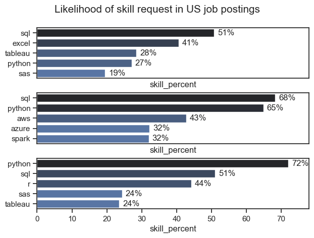
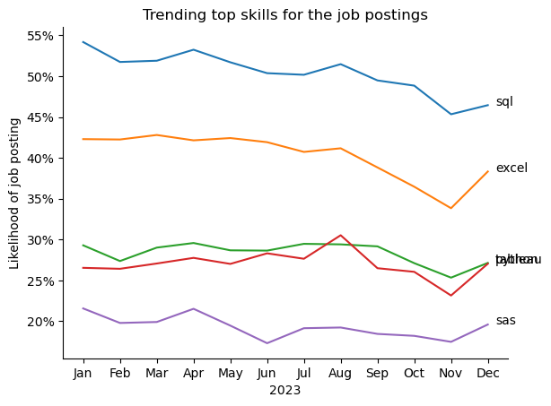
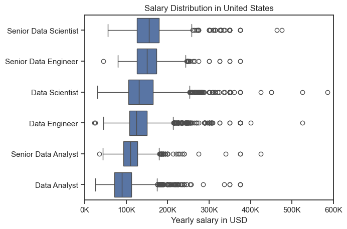
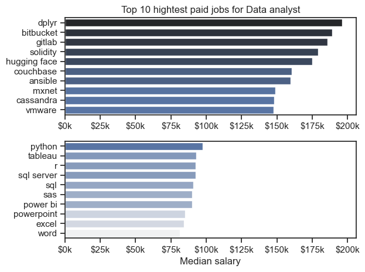
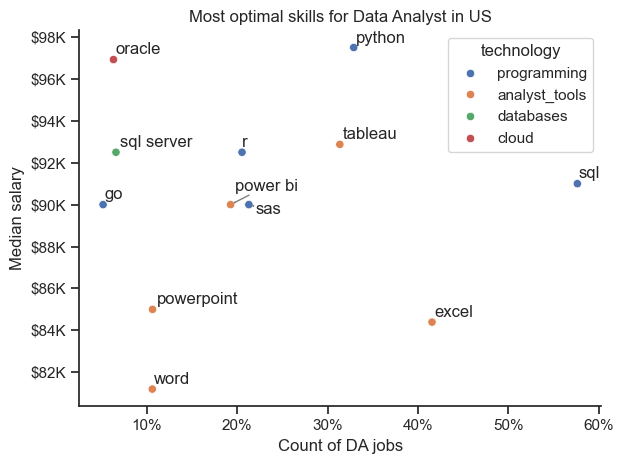

# Over View

The objective of this analysis was to evaluate the landscape of data analyst jobs, particularly focusing on the skills and salary distributions associated with these roles. The analysis leveraged various data visualizations to provide insights into the most optimal skills, highest paid roles, and salary distributions for data analysts in the United States.

# Ask:

## Below are the question I want to answere in my analysis.

High-Paying Skills:

- What specific skills or tools command the highest median salaries for data analysts?

Role-Based Salary Distribution:

- What are the salary distributions for different data analyst roles (e.g., Data Analyst, Senior Data Analyst, Data Scientist, Senior Data Scientist)?

Optimal Skills for Job Opportunities:

- Which skills are most frequently demanded in data analyst job listings?

- How do the demand for specific skills correlate with their associated median salaries?

- What combination of skills offers a balance between high salary and job availability?

# Tools Used

- Python: Primary programming language used for data analysis.
- Pandas: For data manipulation and analysis.
- Matplotlib: For creating static, animated, and interactive visualizations.
- Seaborn: For statistical data visualization, built on top of Matplotlib.
- Jupyter Notebook: For interactive development and data exploration.
- VS Code (Visual Studio Code): As the code editor for writing and debugging code.
- Git: For version control and managing code changes.
- GitHub: For hosting and sharing the project repository and collaborating.

# The Analysis

## what's the most demanded skills in the Data sets

### | Visualize data

```py
import pandas as pd
import matplotlib.pyplot as plt
import seaborn as sns
from datasets import load_dataset

data = load_dataset('lukebarousse/data_jobs')
df = data['train'].to_pandas()
import ast
df['job_posted_date'] = pd.to_datetime(df['job_posted_date'])
df['job_skills'] = df['job_skills'].apply(lambda skill:ast.literal_eval(skill) if pd.notna(skill) else skill )
fig,ax = plt.subplots(len(job_titles), 1)

sns.set_theme(style='ticks')
for i, job_title in enumerate(job_titles):
    df_plot = df_total_perc[df_total_perc['job_title_short'] == job_title].head(5)
    # df_plot.plot(kind='barh', x='job_skills', y='skill_percent', ax=ax[i], title=job_title)
    sns.barplot(data=df_plot, x='skill_percent', y='job_skills',ax = ax[i], hue='skill_count', palette='dark:b_r')

    ax[i].set_ylabel('')

    ax[i].set_xlim(0,78)
    ax[i].legend().set_visible(False)

    for n, v in enumerate(df_plot['skill_percent']):
        ax[i].text(v + 1, n, f'{v:.0f}%', va='center')

    if i != len(job_titles) - 1:
        ax[i].set_xticks([])

fig.suptitle('Likelihood of skill request in US job postings', fontsize = 15)
fig.tight_layout(h_pad=0.5)
plt.show()
```



### Insights form the chart

- General Observations
  High Demand for SQL and Python:

- SQL and Python appear frequently across all job titles, indicating their high demand in the job market.
  SQL is particularly requested in the top two job titles, with skill percentages of 51% and 51% respectively.
  Python shows significant demand in two job titles, with skill percentages of 27% and 65%.
  Skill Diversity:

- Each job title demands a diverse set of skills, suggesting that job roles are becoming increasingly multifaceted and require knowledge in various tools and technologies.

## How are indemand skills trending for Data analysis

### Visualize Data

```py
df_plot = df_DA_US_percent.iloc[:, :5]
sns.lineplot(data=df_plot, dashes=False, palette='tab10')
sns.despine()
plt.title('Trending top skills for the job postings')
plt.ylabel('Likelihood of job posting')
plt.xlabel('2023')
plt.legend().remove()
from matplotlib.ticker import PercentFormatter
ax = plt.gca()
ax.yaxis.set_major_formatter(PercentFormatter(decimals=0))

for i in range(5):
      plt.text(11.2, df_plot.iloc[-1, i], df_plot.columns[i])

plt.show()
```



## Insights

- General Observations
  The chart tracks the likelihood of job postings requiring specific skills over the months of 2023.
  The skills tracked are SQL, Excel, Tableau, Python, and SAS.
  Insights by Skill
  SQL:

- Consistency: SQL remains the most sought-after skill throughout the year, consistently hovering around 50-55%.
  Trend: Although it shows a slight decline towards the end of the year, it remains a dominant skill in job postings.
  Excel:

- Stability: Excel maintains a stable demand, starting the year at around 42% and showing a slight decline towards mid-year before rising again in December.
  Trend: There's a noticeable drop in demand during the second half of the year, but a sharp increase in December.
  Tableau:

- Fluctuations: Tableau sees some fluctuations, with a demand ranging between 25-30%.
  Trend: The demand peaks in August and then declines towards the end of the year, stabilizing in the last quarter.
  Python:

- Consistency: Python shows steady demand, remaining around 27-28% for most of the year.
  Trend: There are minor fluctuations, but overall, Python remains a consistently required skill.
  SAS:

- Least in Demand: SAS has the lowest demand among the tracked skills, ranging between 18-22%.
  Trend: There's a noticeable dip mid-year, but it recovers slightly towards the end of the year.

## 3. How well the job and skills pay to data analyst

### | Visulize Data

```py
sns.boxplot(data=df_US_top6, x='salary_year_avg', y='job_title_short', order=job_title)
sns.set_theme(style='ticks')
plt.title('Salary Distribution in United States')
plt.ylabel('')
plt.xlabel('Yearly salary in USD')
plt.xlim(0,600000)
tick_x = plt.FuncFormatter(lambda y, pos: f'{int(y/1000)}K')
plt.gca().xaxis.set_major_formatter(tick_x)
plt.show()
```



### insights:

- Senior Data Scientist:
  The median salary is around $150k.
  The interquartile range (IQR) spans from approximately $120k to $180k.
  There are significant outliers reaching up to $600k, indicating potential high-paying opportunities or bonuses.

- Senior Data Engineer: The median salary is slightly above $125k.
  The IQR ranges from about $100k to $160k.
  Outliers extend beyond $300k, though not as high as Senior Data Scientists.

- Data Scientist:
  The median salary is around $110k.
  The IQR spans from approximately $90k to $130k.
  There are outliers reaching up to $400k, suggesting some highly lucrative positions.

- Data Engineer:
  The median salary is about $100k.
  The IQR ranges from roughly $80k to $120k.
  Outliers extend beyond $300k, indicating high variability in pay.

- Senior Data Analyst:
  The median salary is around $90k.
  The IQR spans from approximately $70k to $110k.
  Outliers can reach up to $200k, though less frequent than the higher roles.

- Data Analyst:
  The median salary is about $70k.
  The IQR ranges from roughly $50k to $90k.
  Outliers extend beyond $200k, showing some high-paying opportunities, though they are less common.

## How well the job and skills pay for data

### Highes paied most demanded skills for data.

### | Visualize Data

```py
import seaborn as sns

sns.set_theme(style='ticks')
fig, ax = plt.subplots(2,1)
sns.barplot(data=df_DA_top_pay, x='median', y=df_DA_top_pay.index, ax=ax[0], hue='median', palette='dark:b_r', legend=False)


ax[0].set_xlabel('')
ax[0].set_ylabel('')
ax[0].set_title('Top 10 hightest paid jobs for Data analyst')
ax[0].xaxis.set_major_formatter(plt.FuncFormatter(lambda x, pos:f'${int(x/1000)}k'))

sns.barplot(data=df_DA_skills, x='median', y=df_DA_skills.index, ax=ax[1], hue='median', palette='light:b', legend=False)

ax[1].set_xlim(ax[0].get_xlim())
ax[1].set_ylabel('')
ax[1].set_xlabel('Median salary')
ax[1].xaxis.set_major_formatter(plt.FuncFormatter(lambda x, pos: f'${int(x/1000)}k'))
fig.tight_layout()
fig.savefig('top_skills.png', dpi=150)
plt.show()
```



### insights

- Top 10 Highest Paid Jobs for Data Analysts
- Top Tier Salaries:
  dplyr, bitbucket, gitlab, solidity: These technologies command the highest median salaries, reaching up to approximately $200k.
- Insight: Mastery of these tools and technologies can lead to significantly higher earnings in the field of data analysis.
- Upper-Mid Tier Salaries:
  hugging face, couchbase, ansible, mxnet: These technologies offer median salaries ranging from $150k to $175k.
- Insight: These are specialized tools in machine learning, database management, and infrastructure automation, which are highly valued.
  Mid Tier Salaries:

- cassandra, vmware: These technologies provide median salaries between $125k and $150k.
  Insight: Skills in database management (Cassandra) and virtualization (VMware) are also lucrative but slightly less so than the top-tier tools.

## 5. What is the most Optimal skills for data analysts?

### | Visualize data

```py
from adjustText import adjust_text
# df_plot.plot(kind='scatter', x='skill_percent', y='median_salary')
sns.scatterplot(
      data=df_plot,
      x='skill_percent',
      y='median_salary',
      hue='technology'
)

sns.despine()
sns.set_theme(style='ticks')
plt.xlabel('Count of DA jobs')
plt.ylabel('Median salary')
plt.title('Most optimal skills for Data Analyst in US')
from matplotlib.ticker import PercentFormatter
ax = plt.gca()
ax.yaxis.set_major_formatter(plt.FuncFormatter(lambda y, pos: f'${int(y/1000)}K'))
ax.xaxis.set_major_formatter(PercentFormatter(decimals=0))

texts = []
for i, txt in enumerate(df_DA_skills_high_demand.index):
      texts.append(plt.text(df_DA_skills_high_demand['skill_percent'].iloc[i], df_DA_skills_high_demand['median_salary'].iloc[i], txt))
adjust_text(texts, arrowprops = dict(arrowstyle='->', color='gray'))
plt.tight_layout()
plt.show()
```



### insights:

- Skills with High Median Salaries:

- Python stands out with a median salary close to $98k and is highly prevalent, appearing in around 25% of job listings.
- Oracle offers one of the highest median salaries near $98k but appears in fewer job listings compared to other skills.
  SQL Server and Go also command high median salaries around $92k and $90k respectively, though their job listing counts are lower compared to more common tools.
  Skills with High Job Demand:

- SQL is the most demanded skill, appearing in nearly 60% of job listings with a median salary of approximately $90k.
  Excel is also highly prevalent, appearing in around 40% of job listings but offers a lower median salary around $86k.
  Tableau appears in about 30% of job listings with a median salary close to $92k, indicating its strong demand and competitive pay.
  Moderate Salary and Demand Skills:

- R and Power BI offer median salaries around $92k and $90k respectively, with R appearing in around 20% of job listings and Power BI in about 15%.
  SAS and SQL Server appear in roughly 15% and 20% of job listings, with salaries around $90k and $92k respectively.
  Lower Salary and Demand Skills:

- Word and PowerPoint have the lowest median salaries around $82k and $84k respectively and appear in fewer job listings (10%-20%).
  Power BI and SAS are also on the lower end of the demand spectrum with about 15% each, but their median salaries are higher than Word and PowerPoint.

# Key insights:

- High-Paying Skills:

- Top Earners: Tools like dplyr, bitbucket, gitlab, and solidity offer the highest median salaries for data analysts, reaching up to $200k.
- Emerging Technologies: Platforms such as hugging face and solidity are highly valued, reflecting a trend towards high earnings in cutting-edge technologies.
  Role-Based Salary Distribution:

- Senior Roles: Positions like Senior Data Scientist and Senior Data Engineer have higher median salaries (~$150k and $125k respectively) and significant salary variability, indicating potential for substantial earnings.
- Junior Roles: Roles such as Data Analyst offer lower median salaries (~$70k), but there are opportunities for higher earnings in specific contexts.
  Optimal Skills for Job Opportunities:

- High Demand Skills: SQL is the most demanded skill, appearing in nearly 60% of job listings, with a median salary of $90k.

- Balanced Skillsets: Tools like Python, Tableau, and Power BI offer a good balance of high median salaries (~$90k to $98k) and job demand, making them valuable for career growth.
  Lower Salary Skills: General office tools such as Word and PowerPoint are associated with lower median salaries (~$82k to $84k) and less prevalence in job listings.

# Challanges Faced:

- **Data Collection and Cleaning:**
  Gathering accurate and comprehensive data on data analyst job listings was a significant challenge. The data had to be cleaned and pre-processed to ensure consistency and reliability, which involved handling missing values, duplicates, and inconsistencies in job titles and salary information.
- **Skill Categorization:** Categorizing skills into meaningful groups such as technology, programming, analyst tools, databases, and cloud services required careful consideration and sometimes subjective decisions. Ensuring that each skill was appropriately categorized was crucial for accurate analysis.

- **Visualization Clarity:** Creating clear and informative visualizations posed a challenge, especially when dealing with a wide range of data points and ensuring that the charts effectively communicated the insights. Balancing detail with readability was essential to make the visualizations useful.
- **Interpreting Salary Variability:** Analyzing salary distributions involved understanding the reasons behind significant outliers and variations in pay. This required not only statistical analysis but also contextual knowledge of the industry to interpret why certain roles or skills commanded higher salaries.
- **Balancing Detail and Summary:** Summarizing the analysis findings without losing essential details was challenging. It was important to provide a comprehensive overview that still conveyed the nuanced insights from the data.
- **Tool Integration:** Integrating multiple tools like Pandas, Matplotlib, Seaborn, and Jupyter Notebook required ensuring compatibility and efficiency in the workflow. Each tool had its strengths, and leveraging them effectively was necessary for robust analysis.
- **Version Control and Collaboration:** Managing code changes and collaboration through Git and GitHub involved setting up proper version control practices and ensuring that all team members were synchronized with the project’s progress. This included resolving merge conflicts and maintaining a clean commit history.

# Conclusion:

The analysis highlights that specialized tools like dplyr, bitbucket, gitlab, and solidity offer the highest salaries for data analysts, up to $200k. Emerging technologies such as hugging face and mxnet also provide substantial earning potential. Widely-used tools like Python, Tableau, and R offer competitive salaries around $100k, while general tools like Excel and Word have less impact on earning potential. To maximize career growth and salary, data analysts should focus on specialized skills and stay updated with technological advancements. A balanced skill set is essential for navigating the evolving job market and achieving professional success.
