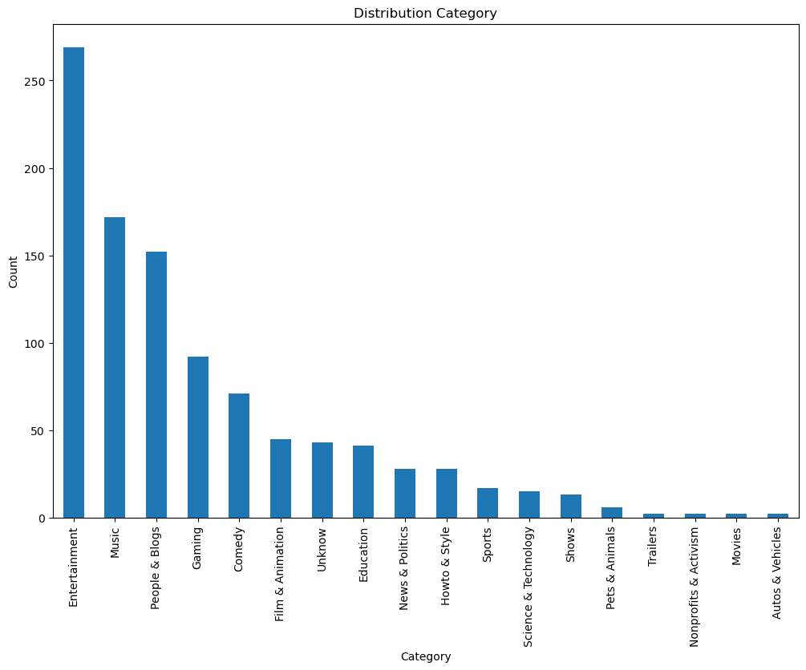

# OverView

- The Top 1000 YouTube Channels dataset offers a comprehensive view of the platform’s most influential creators worldwide. It encompasses essential metrics such as channel rank, name, subscriber count, total video views, video count, category, and inception year. This dataset is instrumental in uncovering trends and growth patterns across various content genres, providing valuable insights into the strategies that drive success on YouTube.

- Analyzing this dataset reveals evolving trends in viewer preferences, content consumption patterns, and the competitive dynamics among channels. It illuminates how channels have grown over time, the impact of different content categories, and the strategies that channels employ to attract and retain audiences. This rich data resource is essential for understanding the evolving landscape of online video content and the factors influencing channel popularity and growth.

# Cleaning and Visualization

- Upon loading the dataset of Top 1000 YouTube Channels, we found it to consist of 1000 entries, each complete with essential information including channel rank, name, subscriber count, total video views, video count, and channel inception year. These key columns were devoid of any missing values, ensuring the integrity and completeness of our initial dataset. However, we did encounter some missing values specifically in the ‘Category’ column. To maintain the dataset’s coherence and facilitate comprehensive analysis, we addressed these missing values by filling them with the category label ‘Unknown’.

- Furthermore, to prepare the dataset for detailed analysis and visualization, we meticulously converted data types as necessary. This step was crucial in ensuring accurate computations and effective presentation of insights. By adhering to these data preparation procedures, we positioned ourselves to explore trends, growth patterns, and content strategies that define the landscape of YouTube’s most influential channels. This approach not only enhances the reliability of our findings but also allows for nuanced interpretations of the factors driving channel popularity and audience engagement on the platform.

# Tool Used

- Python: Primary programming language used for data analysis.
- Pandas: For data manipulation and analysis.
- Matplotlib: For creating static, animated, and interactive visualizations.
- Seaborn: For statistical data visualization, built on top of Matplotlib.
- Jupyter Notebook: For interactive development and data exploration.
- VS Code (Visual Studio Code): As the code editor for writing and debugging code.
- Git: For version control and managing code changes.
- GitHub: For hosting and sharing the project repository and collaborating.

# Analysis

### Visualize

```py
import pandas as pd
import matplotlib.pyplot as plt
import seaborn as sns
import warnings
warnings.filterwarnings('ignore')
data = pd.read_csv('Top_youtuber_dataset.csv', encoding='latin')
data
```

### Visualize

```py
plt.figure(figsize=(10,6))
sns.histplot(data=data['Subscribers'], bins=30, kde=True)
plt.xlabel('Subscribers')
plt.ylabel('Frequnecy')
plt.title('Distribution of Subscribers')
plt.show()
```


### Visualize

```py
plt.figure(figsize=(10,6))
sns.boxplot(x=data['Video Views'])
plt.xlabel('Video Views')
plt.title('Video views')
plt.show()
```


### Visualize

```py
plt.figure(figsize=(12,8))
data['Category'].value_counts().plot(kind='bar')
plt.xlabel('Category')
plt.ylabel('Count')
plt.title('Distribution Category')
plt.show()
```



### Visualize

```py
plt.figure(figsize=(14,8))
sns.set_theme(style='ticks')
sns.countplot(x='Started', data=data, order=data['Started'].value_counts().index, hue='Started', palette='dark:b')
plt.xlabel('Year Started')
plt.ylabel('Number of channel')
plt.title('Number of channel start each year')
plt.xticks(rotation=90)
plt.show()
```


### Visualize

```py
plt.figure(figsize=(10,6))
sns.scatterplot(data=data, x='Started', y='Subscribers')
plt.xlabel('Year Started')
plt.ylabel('Subscribers')
plt.title('Subscriber as per years')
plt.show()
```


### Visualize

```py
avg_subs_category = data.groupby('Category')['Subscribers'].mean().sort_values(ascending=False)
avg_subs_category
plt.figure(figsize=(12,8))
avg_subs_category.plot(kind='bar')
plt.xlabel('Category')
plt.ylabel('Average Subscriber')
plt.title('Average subscriber per category')
plt.xticks(rotation=45)
plt.show()
```


# Insights

- The visualizations provided a comprehensive view of the Top 1000 YouTube Channels dataset, offering valuable insights into subscriber counts, video views, category distribution, and channel inception trends. The histogram of subscriber counts revealed a skewed distribution, showcasing that a majority of channels boast a substantial number of subscribers, while a few have exceptionally high counts. This distribution underscores the varying scales of influence among YouTube channels.

- Box plots depicting video views highlighted notable outliers, indicating channels with remarkably high view counts compared to others. This variation illustrates the diverse levels of viewership and engagement across the platform. Bar charts detailing category distribution reinforced the popularity of specific content genres, shedding light on viewer preferences and the competitive dynamics within different niches.

- A trend analysis of channel inception years unveiled a steady growth in channel creation over time, with a pronounced increase in recent years. This trend mirrors the expanding accessibility and widespread adoption of YouTube as a primary medium for content consumption and creator expression. Additionally, a scatter plot plotting the year channels started against their subscriber counts revealed a trend where older channels generally amassed more subscribers, reflecting the cumulative audience growth over extended periods.

- These visualizations not only provided clarity on data distributions and trends but also facilitated a deeper understanding of the factors influencing channel popularity and longevity on YouTube.

# Conclusion

The analysis of the Top 1000 YouTube Channels dataset offers essential insights into the dynamics of successful channels on the platform. By examining subscriber counts, video views, and content categories, this analysis helps benchmark performance and craft effective content strategies. In an evolving digital landscape, these insights are crucial for content creators, marketers, and researchers alike, enabling them to adapt to changing trends, optimize audience engagement, and stay competitive in reaching and retaining their audiences on YouTube.
